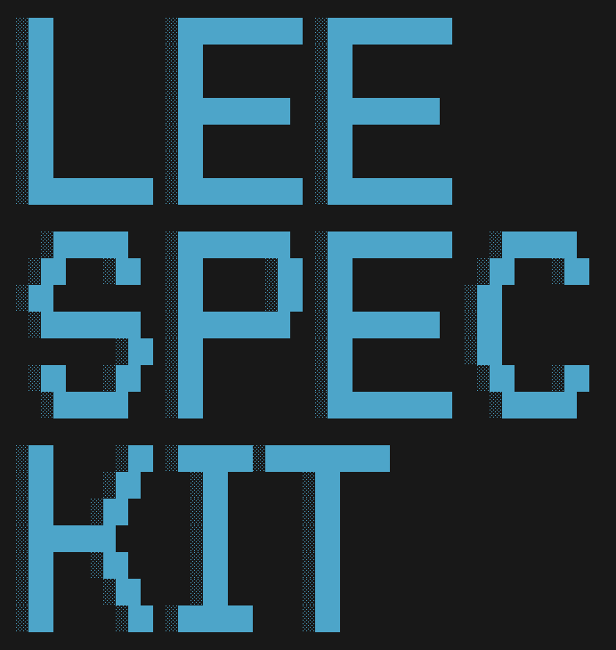

<h1 align="center">
  <strong>lee-spec-kit</strong>
</h1>

<div align="center">

</div>

<p align="center">
  <strong>Document-centered harness engineering toolkit for AI agent development</strong>
</p>

<p align="center">
  <a href="https://www.npmjs.com/package/lee-spec-kit"></a>
  
  <a href="https://opensource.org/licenses/MIT"></a>
</p>

<p align="center">
  <a href="#quick-start">Quick Start</a> •
  <a href="#why-it-exists">Why</a> •
  <a href="#main-commands">Commands</a> •
  <a href="#docs">Docs</a>
</p>

<p align="center">
  <a href="./README.en.md">
    
  </a>
  <a href="./README.md">
    
  </a>
</p>

---

## Quick Start

`lee-spec-kit` creates PRD, idea, and feature docs, then helps agents work from those documents.

```bash
npx lee-spec-kit init
npx lee-spec-kit integrations codex-hooks
npx lee-spec-kit idea improve-auth-flow
npx lee-spec-kit feature user-auth
```

After that, the human can keep using normal natural-language requests.

## Why It Exists

This CLI was built to keep documents and actual execution flow together when working with an AI agent.

It is not just a tool that creates a docs folder. It is closer to a harness that helps the agent handle the active feature, the next action, and the points where user approval is required under the same set of rules.

The project structure follows an SDD (spec-driven development) flow: `PRD → idea → feature`. PRD is where top-level requirements are written under `docs/prd/`, idea is for candidate approaches or experiments, and feature is the stage where actual work is managed through `spec.md`, `plan.md`, `tasks.md`, and `decisions.md`.

The overall approach is influenced by [spec-kit](https://github.com/github/spec-kit) and [OpenSpec](https://github.com/Fission-AI/OpenSpec).

## Humans Usually Ask Like This

- "Organize ideas from these requirements."
- "Promote this idea into a feature and move it forward."
- "Draft the issue from the current feature docs."
- "Continue the next feature according to the rules."
- "Check the docs and code together before we finish."

## Main Commands

- `init`
- `idea`
- `feature`
- `task add`
- `decision add`
- `docs`
- `detect`
- `github`
- `integrations codex-hooks`: install/remove hooks in the workspace and configured project roots
- `integrations codex`: install/remove the optional global `[features].hooks` setting
- `commit-audit --json`
- `workflow-audit --json`
- `local merge <feature-ref> --json`: fast-forward a completed local Feature into its base branch and run post-merge checks
- `local cleanup <feature-ref> --json`: remove the managed worktree and optionally delete the integrated Feature branch

Supported modes:

- `embedded`: keep `docs/` inside the project repository.
- `standalone`: keep the docs repo and project repo separate under a shared workspace root.

## Docs

- [Public CLI Reference](./docs/reference/public-cli.md)
- [Agent CLI Reference](./docs/reference/agent-cli.md)
- [Internal CLI Reference](./docs/reference/internal-cli.md)
- [Codex Hooks Integration](./docs/reference/codex-hooks.md)
- [Migration Guide](./docs/reference/migration-codex-hooks.md)
- [Reference Index](./docs/reference/README.md)

## License

MIT
