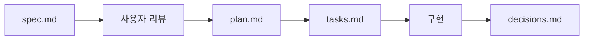

<h1 align="center">
  <strong>lee-spec-kit</strong>
</h1>

<div align="center">

</div>

<p align="center">
  <strong>AI 에이전트 기반 개발을 위한 프로젝트 문서 구조 생성 CLI</strong>
</p>

<p align="center">
  <a href="https://www.npmjs.com/package/lee-spec-kit"></a>
  
  <a href="https://opensource.org/licenses/MIT"></a>
</p>

<p align="center">
  <a href="#quick-start">Quick Start</a> •
  <a href="#주요-기능">주요 기능</a> •
  <a href="#사용법">사용법</a> •
  <a href="#생성되는-구조">생성되는 구조</a>
</p>

<p align="center">
  <a href="./README.en.md">
    
  </a>
  <a href="./README.md">
    
  </a>
</p>

---

## 목차

- [Quick Start](#quick-start)
- [신규 프로젝트 시작 순서](#신규-프로젝트-시작-순서)
- [에이전트 킥오프 프롬프트](#에이전트-킥오프-프롬프트)
- [주요 기능](#주요-기능)
- [사용법](#사용법)
- [설정 파일](#설정-파일)
- [오류 코드](#오류-코드)
- [생성되는 구조](#생성되는-구조)
- [Feature 워크플로우](#feature-워크플로우)
- [문제 해결](#문제-해결)
- [기여하기](#기여하기)
- [라이선스](#라이선스)

## Quick Start

```bash
# 1. 프로젝트 문서 구조 생성
npx lee-spec-kit init

# 2. 초기 온보딩 점검
npx lee-spec-kit onboard --strict

# 3. 새 기능 생성
npx lee-spec-kit feature user-auth

# 4. 진행 상황 및 다음 단계 확인 (AI 에이전트용)
npx lee-spec-kit context

# 5. 워크플로우 대시보드 확인
npx lee-spec-kit view

# 6. 전체 상태 확인
npx lee-spec-kit status

# 7. 문서/Feature 진단
npx lee-spec-kit doctor
```

## 신규 프로젝트 시작 순서

신규 프로젝트에서는 **코드 스캐폴딩을 먼저** 하고, 그 다음 docs를 초기화하세요.
대부분의 사용자(기본값: embedded)는 프로젝트 루트에서 `npx lee-spec-kit init`만 실행하면 됩니다.

```bash
# 0. 코드 프로젝트 생성/초기화 (예: Next.js)
npx create-next-app@latest my-app
cd my-app

# 1. docs 구조 초기화
npx lee-spec-kit init

# 2. 초기 온보딩 점검
npx lee-spec-kit onboard --strict

# 3. 감지 확인 (에이전트 시작점)
npx lee-spec-kit detect --json

# 4. Feature 생성 후 작업 시작
npx lee-spec-kit feature user-auth
npx lee-spec-kit context --json-compact
```

- `detect --json` 결과가 `isLeeSpecKitProject: true`일 때 lee-spec-kit 워크플로우를 적용하세요.
- `isLeeSpecKitProject: false`면 일반 프로젝트 워크플로우로 진행하세요.

docs를 코드 저장소와 분리해 운영하는 팀(standalone)은 **상위 워크스페이스 폴더**를 기준으로 시작하는 것을 권장합니다.

```bash
# 권장 레이아웃:
# workspace/
#   ├─ docs/      (lee-spec-kit 문서)
#   └─ project/   (실제 코드 저장소)
#
# workspace 루트에서 실행
npx lee-spec-kit init --docs-repo standalone --dir ./docs --project-root ./project
npx lee-spec-kit detect --json
```

## 에이전트 킥오프 프롬프트

아래 프롬프트를 에이전트 시작 메시지로 그대로 사용할 수 있습니다.

```text
작업 시작 절차:
1) npx lee-spec-kit detect --json
2) isLeeSpecKitProject === true 이면 npx lee-spec-kit context --json-compact 실행 (필요 시 --json으로 상세 조회)
3) actionOptions가 있으면 approvalPrompt와 finalPrompt를 그대로 사용자에게 제시하고 승인(<LABEL> 또는 <LABEL> OK) 대기
4) 승인 전에는 실행하지 말고, requiresUserCheck=true 액션은 승인 후에만 실행
5) isLeeSpecKitProject === false 이면 lee-spec-kit 전용 절차를 건너뛰고 일반 워크플로우로 진행
```

## 주요 기능

### 📁 프로젝트 초기화

- 대화형 모드 또는 CLI 옵션으로 프로젝트 설정
- 기본값은 Multi이며, Single도 단순 단일 레포/기존 호환 시나리오를 위해 지원합니다. (`fullstack`는 `multi` 하위호환 alias)
- 한국어/영어 템플릿 선택

### 🚀 Feature 생성

- spec.md, plan.md, tasks.md, decisions.md 자동 생성
- Multi 프로젝트에서 임의 컴포넌트(app/api/worker 등) 분리 지원
- GitHub Issue/PR 템플릿 연동

### 📊 상태 관리

- 전체 Feature 진행 상태 한눈에 확인
- 터미널 출력 또는 마크다운 파일로 저장

### 👀 View 대시보드

- Context 기반 워크플로우 현황을 한 번에 확인
- 단일 Feature/전체 Feature 모두 조회 가능

### 🔁 Flow 오케스트레이션

- `context + status + doctor`를 한 번에 실행/요약
- 승인/실행 옵션을 그대로 전달해 원자 액션 자동화 가능

### 🩺 문서 진단 (Doctor)

- docs 구조/설정/Feature 메타데이터를 점검하여 잠재 문제를 빠르게 탐지
- `--json` 출력으로 에이전트 파이프라인에 쉽게 연동

### 🔄 자동 업데이트

- 최신 버전 체크 및 템플릿 업데이트 지원

## 사용법

### 프로젝트 초기화

```bash
# 대화형 모드
npx lee-spec-kit init

# 옵션 지정
npx lee-spec-kit init --name my-project --type multi
npx lee-spec-kit init --name my-project --type fullstack  # alias
```

**옵션:**

| 옵션                | 설명                                                                 | 기본값                    |
| ------------------- | -------------------------------------------------------------------- | ------------------------- |
| `-n, --name <name>` | 프로젝트 이름                                                        | 현재 폴더명               |
| `-t, --type <type>` | `single` 또는 `multi` (`fullstack` alias 지원)                        | 대화형 선택 (`--yes`/`--non-interactive`면 `multi`) |
| `--components <list>` | multi 컴포넌트 목록 (쉼표 구분, 예: `app,api,worker`)                | `app`                     |
| `-l, --lang <lang>` | `ko` (한국어) 또는 `en` (영어)                                       | `en`                      |
| `--workflow <mode>` | 워크플로우 모드: `github`(issue/PR/review 포함) 또는 `local`(로컬 중심) | `github`                  |
| `-d, --dir <dir>`   | 설치 디렉토리                                                        | `./docs`                  |
| `--docs-repo <mode>` | docs 레포 모드 (`embedded` 또는 `standalone`)                        | `embedded`                |
| `--project-root <path>` | standalone(single) 프로젝트 레포 경로 또는 standalone(multi) JSON 매핑 (`{"app":"/path/app","api":"/path/api"}`) | -                         |
| `--component-project-roots <pairs>` | standalone(multi) 컴포넌트별 레포 경로 (`app=/path/app,api=/path/api,worker=/path/worker`) | - |
| `--push-docs` | standalone docs 원격 push 사용 (`--docs-remote`와 함께 사용)     | `false`                   |
| `--docs-remote <url>` | standalone docs 원격 URL (`--push-docs`와 함께 사용)              | -                         |
| `-y, --yes`         | 대화형 입력을 대부분 스킵 (단, 대상 디렉토리가 비어있지 않으면 덮어쓰기 확인은 표시) | -                         |
| `-f, --force`       | 대상 디렉토리가 비어있지 않아도 확인 없이 덮어쓰기                  | `false`                   |
| `--non-interactive` | 사용자 입력이 필요하면 프롬프트 대신 즉시 실패                       | `false`                   |

> `init`은 docs 생성 후 Git 초기화/커밋(`git init`, `git add`, `git commit`)을 자동 시도합니다. 환경에 따라 자동 커밋이 생략될 수 있습니다.

### 프로젝트 감지 (에이전트 시작점)

```bash
# 현재 경로 기준 감지
npx lee-spec-kit detect

# 에이전트/자동화용 JSON
npx lee-spec-kit detect --json

# 특정 경로 기준 감지
npx lee-spec-kit detect --dir /path/to/workspace
```

`--json` 출력은 `isLeeSpecKitProject`, `reasonCode`(`PROJECT_DETECTED` | `PROJECT_NOT_DETECTED`), `docsDir`, `configPath`, `detectionSource`(`config` | `heuristic`)를 포함합니다.

### 온보딩 점검

초기 설정(Constitution/PRD/Git remote 등) 준비 상태를 점검합니다.

```bash
# 사람 읽기 쉬운 출력
npx lee-spec-kit onboard

# 에이전트/자동화용 JSON
npx lee-spec-kit onboard --json

# WARN/BLOCK이 있으면 종료 코드 1
npx lee-spec-kit onboard --strict
```

### 새 기능 생성

```bash
# Single 프로젝트
npx lee-spec-kit feature user-auth

# Multi 프로젝트
npx lee-spec-kit feature --component api user-auth
npx lee-spec-kit feature --component app user-profile
npx lee-spec-kit feature --component worker queue-jobs

# Feature ID/설명 지정
npx lee-spec-kit feature payment --id F123 --desc "결제 플로우 개선"
```

**옵션:**

| 옵션                | 설명                                         | 기본값      |
| ------------------- | -------------------------------------------- | ----------- |
| `--component <id>`  | multi 대상 컴포넌트                           | 대화형 선택 |
| `--id <id>`         | Feature ID (`F001` 형식)                     | 자동 생성   |
| `-d, --desc <desc>` | `spec.md`의 목적(설명) 기본 문구             | 빈 문자열   |
| `--non-interactive` | 사용자 입력이 필요하면 프롬프트 대신 즉시 실패 | `false`     |
| `--json`            | JSON 출력 (`featureId`, `featurePath`, `component`) | `false` |

### Context 확인 (AI 에이전트 가이드)

현재 작업 중인 Feature의 상태와 다음 할 일을 확인합니다. 특히 AI 에이전트가 프로세스를 준수하는 데 유용합니다.
단일 Feature 상세에서는 다음 작업을 항상 `A/B/C` 옵션으로 표시합니다.

```bash
# 기본 조회 (브랜치 기준 자동 감지)
npx lee-spec-kit context

# 특정 Feature 상태 + 라벨 확인 (에이전트 권장)
npx lee-spec-kit context F001
npx lee-spec-kit context F001 --json
npx lee-spec-kit context F001 --json-compact

# 승인 + 실행 (일반 케이스)
npx lee-spec-kit context F001 --approve A --execute

# 선택된 액션이 `requiresUserCheck=true`일 때만 티켓 포함
npx lee-spec-kit context F001 --approve A --execute --ticket <TICKET>

# 엄격 실행 모드 (instruction-only 라벨이면 실패)
npx lee-spec-kit context F001 --approve A --execute --ticket <TICKET> --execute-strict
```

고급 선택자(`--component`, `--all`, `--done`)는 multi 범위 제어나 예외 상황에서만 사용하세요.

**옵션:**

| 옵션            | 설명                                            |
| --------------- | ----------------------------------------------- |
| `--json`        | 에이전트용 JSON 출력                            |
| `--json-compact` | 에이전트용 압축 JSON 출력 (`--json` 포함, 중복 필드 최소화) |
| `--component <id>` | multi에서 대상 컴포넌트 지정 (예: `app`, `api`, `worker`) |
| `--all`         | 자동 감지 실패 시 완료된 Feature까지 포함해서 표시 |
| `--done`        | 완료(workflow-done) Feature만 표시              |
| `--approve <reply>` | 라벨 포함 승인 응답으로 단일 옵션 선택 (예: `A`, `A OK`, `A 진행해`) |
| `--ticket <token>` | `--approve` 결과에서 받은 1회용 실행 티켓 (`requiresUserCheck=true` 옵션에서 필요) |
| `--execute`     | 승인된 command 옵션 1개만 실행 (`requiresUserCheck=true`면 `--ticket` 필요) |
| `--execute-strict` | `--execute`와 함께 사용 시 instruction-only 옵션이면 실패 |

**티켓(approval ticket)이란?**

- `--approve`로 라벨을 승인할 때 CLI가 발급하는 1회용 실행 토큰입니다.
- 선택한 액션이 `requiresUserCheck=true`인 경우에만 `--execute`에서 `--ticket`이 필요합니다.
- 발급 후 짧은 시간(기본 5분)만 유효하며, 한 번 사용하면 재사용할 수 없습니다.

기본 권장 포맷은 `context --json-compact`이며, 같은 판단 정보를 중복 없이 축약해 전달합니다.  
`context --json`은 디버깅/세부 필드 확인이 필요할 때만 사용하세요.

**핵심 필드 (실사용 권장)**

- `status`/`reasonCode`: 현재 상태와 이유 코드
- `actions[]`: 원자 액션 목록
  - `type: "command"`: `scope`(project|docs), `cwd`, `cmd`, `category`, `operationType`, `requiresUserCheck`
  - `type: "instruction"`: `message`, `category`, `operationType`, `requiresUserCheck`
- `actionOptions[]`: `label`(`A`, `B`, `C`...) + 실행 대상 `action` + 사용자 안내용 `summary`/`detail`/`approvalPrompt`
- `approvalRequest`: 승인 요청/실행에 바로 사용하는 안내 데이터 (`labels`, `approveCommand`, `executeCommand`, `options[]`)
- `requiredDocs`: 현재 액션 전에 읽어야 할 CLI 내장 문서 목록 (`id`, `command`)
- `checkPolicy`: 승인 검증 정책 (`token`, `acceptedTokens`, `tokenPattern`, `validLabels`, `contextVersion` 등)
- `agentOrchestration`: 메인(대화/승인) + 서브(명령 실행) 역할 분리 계약. 현재 SSOT는 `subAgentHandoff`와 `matchedFeature.currentSubstate*`이며, `delegateCommandExecution`/`longRunningCategories`/`currentActionShouldDelegate`는 compatibility field입니다.
- `matchedFeature.currentSubstateId/currentSubstateOwner/currentSubstatePhase`: step 내부 실행 상태와 owner/phase 기반 오케스트레이션 판단용 필드

**고급/참고 필드 (자동화 고급 시나리오 또는 디버깅용)**

- `selectionFallback`: 자동 감지 실패 시 사용된 폴백 (`none` | `open_features` | `all_features` | `done_features`)
- `primaryActionLabel`/`primaryActionType`/`primaryActionCategory`/`primaryActionOperationType`: 첫 번째 원자 액션 요약 메타데이터
- `workflowPolicy`: 현재 완료 조건 정책 (`mode`, `requireIssue`, `requireBranch`, `requirePr`, `requireReview`)
- `taskCommitGatePolicy`: 태스크 커밋 게이트 정책 (`off` | `warn` | `strict`)
- `prePrReviewPolicy`: pre-PR 리뷰 정책 (`enabled`, `skills`, `fallback`)

오류 응답(`status: "error"`)에는 `reasonCode`와 `suggestions`(라벨형 다음 동작: `A/B/C`)가 포함됩니다. (예: `INVALID_APPROVAL`, `CONTEXT_STALE`, `EXECUTION_FAILED`, `EXECUTION_NOT_COMMAND`)

### CLI 내장 문서 조회

`agents.md`를 프로젝트에 복구하지 않는 환경에서는 아래 명령으로 내장 가이드를 직접 조회할 수 있습니다.
`docs get create-issue|issue-doc|create-pr|pr-doc --json` 응답에는 `contract`(필수 섹션/아티팩트 규칙)도 포함됩니다.

```bash
# 조회 가능한 내장 문서 목록
npx lee-spec-kit docs list --json

# 루트 가이드
npx lee-spec-kit docs get agents --json

# 이슈/PR 절차 + 템플릿
npx lee-spec-kit docs get create-issue --json
npx lee-spec-kit docs get issue-doc --json
npx lee-spec-kit docs get create-pr --json
npx lee-spec-kit docs get pr-doc --json
```

### View 대시보드

```bash
npx lee-spec-kit view
npx lee-spec-kit view F001
npx lee-spec-kit view --all
npx lee-spec-kit view --json
```

**옵션:**

| 옵션            | 설명                                            |
| --------------- | ----------------------------------------------- |
| `--json`        | 에이전트용 JSON 출력                            |
| `--component <id>` | multi에서 대상 컴포넌트 지정 (예: `app`, `api`, `worker`) |
| `--all`         | 자동 감지 실패 시 완료된 Feature까지 포함해서 표시 |
| `--done`        | 완료(workflow-done) Feature만 표시              |

### Flow 오케스트레이션

```bash
# 워크플로우 요약 (context + status + doctor)
npx lee-spec-kit flow

# 승인 + 실행 (에이전트 기본 실행 경로)
npx lee-spec-kit flow F001 --approve A --execute

# 자동 진행: 특정 category가 나오면 멈추고 사용자 승인 대기
npx lee-spec-kit flow F004 --auto-until-category pr_create,code_review,pr_status_update

# 자동 진행: preset 사용
npx lee-spec-kit flow F004 --auto-preset pr-handoff

# 자동 진행 + 새 요청 선반영(user_request_replan 우선 실행)
npx lee-spec-kit flow F004 --request "issue 004를 F004로 승격시켜서 진행해" --auto-until-category pr_create,code_review,pr_status_update

# 기본 preset 설정 시 더 짧게 실행 가능
npx lee-spec-kit flow F004 --request "issue 004를 F004로 승격시켜서 진행해"

# 장시간 자동 진행: run 체크포인트 생성 + 재개
npx lee-spec-kit flow F004 --auto-until-category pr_create,code_review,pr_status_update --start-auto --json-compact
npx lee-spec-kit flow --resume <RUN_ID> --json-compact

# 에이전트 파이프라인용 JSON
npx lee-spec-kit flow --json
npx lee-spec-kit flow --json-compact

# 엄격 검사(선택)
npx lee-spec-kit flow --strict
```

**옵션:**

| 옵션               | 설명 |
| ------------------ | ---- |
| `--json`           | 에이전트용 JSON 출력 |
| `--json-compact`   | 에이전트용 압축 JSON 출력 (`--json` 포함, 중복 필드 최소화) |
| `--component <id>` | multi에서 대상 컴포넌트 지정 (예: `app`, `api`, `worker`) |
| `--all`            | 자동 감지 실패 시 완료된 Feature까지 포함해서 표시 |
| `--done`           | 완료(workflow-done) Feature만 표시 |
| `--request <text>` | auto 모드에서 새 사용자 요청을 먼저 반영 (`user_request_replan` 라벨 자동 선택) |
| `--auto-preset <name>` | 이름 기반 auto preset 사용 (기본 제공: `pr-handoff`) |
| `--auto-until-category <categories>` | command 액션을 자동 실행하다가 지정 category 중 하나가 나오면 중지 (쉼표 구분) |
| `--start-auto`     | auto 실행 체크포인트(run id) 저장 후 JSON에 재개 정보(`autoRun.run`)를 함께 출력 |
| `--resume <run-id>` | 저장된 auto 실행 체크포인트를 run id로 재개 |
| `--approve <reply>`| context 라벨 승인 응답 전달 (예: `A`, `A OK`, `A 진행해`) |
| `--execute`        | 승인한 옵션이 command일 때 실행 (`requiresUserCheck=true`면 티켓 연동, 아니면 티켓 없이 실행) |
| `--execute-strict` | `--execute`와 함께 사용 시 instruction-only 옵션이면 실패 |
| `--strict`         | `status --strict`, `doctor --strict`까지 함께 검사 |

자동 게이트 모드 규칙:
- auto 모드(`--auto-until-category`/`--auto-preset`) 사용 시 `<feature-name>`은 필수입니다. (예: `F004`)
- auto 모드(`--auto-until-category`/`--auto-preset`)는 `--approve`, `--execute`와 함께 사용할 수 없습니다.
- `--request`는 auto 모드와 함께 사용해야 합니다.
  - 예외적으로 `workflow.auto.defaultPreset`이 설정되어 있으면 `--request`만으로도 auto 모드가 활성화됩니다.
- `--resume <run-id>`는 `<feature-name>`, `--component`, `--all`, `--done`, `--auto-*`, `--request`와 함께 사용할 수 없습니다. (체크포인트에 저장된 설정을 사용)
- 자동 진행은 지정한 category가 등장하면 `gate_reached`로 멈추고, 해당 단계의 승인 문구(`approvalRequest.userFacingLines`)를 그대로 출력합니다.
- 현재 액션이 instruction-only라 command 자동 실행이 불가능하면 `AUTO_MANUAL_REQUIRED`로 멈출 수 있습니다. (CLI 오류가 아니라 자동화 경계 도달 상태)
- 진행 정체(동일 context/action 반복)가 감지되면 `AUTO_NO_PROGRESS`로 중단됩니다.
- JSON 모드에서는 `autoRun.status`, `autoRun.reasonCode`, `autoRun.gate`, `autoRun.executions`, `autoRun.resume`로 상세 상태를 확인할 수 있습니다.
- JSON `agentOrchestration`과 `matchedFeature.currentSubstate*`로 메인/서브 에이전트 역할 및 중단/보고 조건을 확인할 수 있습니다.
  - 위임 판단은 `matchedFeature.currentSubstateOwner`와 `subAgentHandoff`를 우선 사용하세요. `longRunningCategories`와 `currentActionShouldDelegate`는 substate가 없는 레거시 경로용 compatibility 메타데이터입니다.
- `--start-auto`를 사용하면 JSON `autoRun.run`에 `runId`, `status`, `resumeCommand`가 포함됩니다.

에이전트 재개 규칙(권장):
- `flow --json-compact`(또는 `flow --json`) 결과에 `autoRun.enabled=true`가 있으면, 중단/압축 후에도 `autoRun.resume.flowCommand`를 그대로 재실행해 이어갑니다.
- 재개 전 현재 지점 확인이 필요하면 `autoRun.resume.contextCommand`를 먼저 실행합니다.
- `context --json-compact`(또는 `context --json`) 확인 결과 `approvalRequest.required=true`면 즉시 멈추고 사용자에게 보고합니다.
- `--start-auto`를 사용하는 경우에는 `autoRun.run.resumeCommand`(`flow --resume <runId>`)를 우선 재개 경로로 사용합니다.

### GitHub helper

```bash
# 선택된 Feature 기준 Issue 본문 생성
npx lee-spec-kit github issue F001

# Issue 본문 생성 + 실제 Issue 생성
npx lee-spec-kit github issue F001 --create --confirm OK --labels enhancement,frontend

# PR 본문 생성
npx lee-spec-kit github pr F001

# PR 본문 생성 (스크린샷/Mermaid 섹션 강제 포함)
npx lee-spec-kit github pr F001 --screenshots on --mermaid on

# PR 본문 생성 + PR 생성 + tasks.md 메타데이터 동기화 + merge 재시도
npx lee-spec-kit github pr F001 --create --merge --confirm OK --labels enhancement,frontend
```

핵심 동작:
- Issue/PR helper는 필수 섹션과 관련 문서 경로를 검증합니다.
- `--json` 출력에는 `body`(본문 문자열)와 `bodyFile`(파일 경로)가 함께 제공됩니다.
- 라벨은 최소 1개 이상 필수입니다.
- `--create`/`--merge`는 원격 작업이므로 `--confirm OK`가 필요합니다.
- PR helper는 기본적으로 `tasks.md`의 `PR`/`PR Status`를 동기화합니다. (`--no-sync-tasks`로 비활성화)
- PR helper의 아티팩트 섹션은 `--screenshots (auto|on|off)`, `--mermaid (auto|on|off)`로 제어할 수 있습니다.
- merge 시 head 브랜치가 뒤쳐진 경우 fetch/rebase/force-push 후 재시도합니다.

### 상태 확인

```bash
# 터미널에 출력
npx lee-spec-kit status

# 에이전트용 JSON 출력
npx lee-spec-kit status --json

# 파일로 저장
npx lee-spec-kit status --write

# 중복/누락 ID가 있으면 실패 코드로 종료
npx lee-spec-kit status --strict
```

**옵션:**

| 옵션           | 설명                                          |
| -------------- | --------------------------------------------- |
| `--json`       | 에이전트용 JSON 출력                          |
| `-w, --write`  | `features/status.md` 파일 생성                |
| `-s, --strict` | 중복/누락 Feature ID 발견 시 종료 코드 1 반환 |

상태값은 구현 완료와 워크플로우 완료를 구분합니다.
- `DONE`: 태스크는 모두 완료됐지만 워크플로우 요구사항이 완전히 충족되진 않음
- `WORKFLOW_DONE`: 구현 + 워크플로우 요구사항까지 모두 충족

### PRD 요구사항 추적

PRD 요구사항 ID(`PRD-FR-001` 등)와 Feature `tasks.md` 태그(`[PRD-FR-001]`)를 기반으로 PRD 커버리지를 집계합니다.

SSOT(단일 기준) 권장:
- PRD(`docs/prd/`): 요구사항 SSOT (ID 안정성 유지)
- Ideas(`docs/ideas/`): Feature 전 단계 (상단에 `PRD Refs` 기록)
- Features(`docs/features/`): 구현/진행 SSOT (`spec.md`의 `PRD Refs`, `tasks.md`의 태스크 태그, `decisions.md`의 변경 기록)

중간에 요구사항/범위가 바뀌면 최소 아래를 함께 갱신하세요:
- PRD 문서 + `spec.md`의 `PRD Refs` + `tasks.md`의 태스크 태그
- (필요 시) `plan.md`, `decisions.md`

```bash
# 터미널에 출력
npx lee-spec-kit requirements

# alias
npx lee-spec-kit prd

# 에이전트용 JSON 출력
npx lee-spec-kit requirements --json

# 파일로 저장 (docs/prd/status.md)
npx lee-spec-kit requirements --write

# 이슈가 있으면 종료 코드 1 (unknown refs / unmapped tasks / untracked requirements)
npx lee-spec-kit requirements --strict --json
```

### 공통 옵션

```bash
# 도움말 배너 숨김
npx lee-spec-kit --no-banner --help
```

또는 환경변수 `LEE_SPEC_KIT_NO_BANNER=1`로 배너 출력을 비활성화할 수 있습니다.
비TTY 출력(예: 에이전트/파이프라인)에서는 배너가 기본적으로 출력되지 않습니다.

### 문서 진단 (Doctor)

docs 구조 및 Feature 메타데이터(중복 ID, 누락된 파일/상태, 플레이스홀더 잔존 등)를 점검합니다.

```bash
# 진단 실행
npx lee-spec-kit doctor

# 문제 발견 시 종료 코드 1 (CI/에이전트 파이프라인용)
npx lee-spec-kit doctor --strict

# 에이전트용 JSON 출력
npx lee-spec-kit doctor --json

# 안전한 자동 수정 적용
npx lee-spec-kit doctor --fix

# 수정 예정 항목만 미리 확인 (파일 미변경)
npx lee-spec-kit doctor --fix --dry-run

# decisions.md 플레이스홀더 진단 레벨 조정
npx lee-spec-kit doctor --decisions-placeholders off
npx lee-spec-kit doctor --decisions-placeholders info
npx lee-spec-kit doctor --decisions-placeholders warn
```

- `--decisions-placeholders <mode>`
  - `off`: `decisions.md` 플레이스홀더를 진단에서 제외
  - `info` (기본): 정보 레벨로만 보고 (strict 실패 대상 아님)
  - `warn`: 경고로 보고

### 템플릿 업데이트

기본 동작은 `docs/` 작업트리에 변경사항이 없을 때만 업데이트를 진행하며, 이 경우 변경된 파일은 확인 없이 덮어씁니다.  
변경사항이 있는 상태에서 업데이트하려면 `--force`를 사용하세요.
또한 `update`는 `.lee-spec-kit.json`의 누락 필드를 현재 기본 정책으로 보강합니다. (예: `workflow.taskCommitGate: "warn"`)

```bash
# 전체 업데이트
npx lee-spec-kit update

# agents/ 폴더만 업데이트
npx lee-spec-kit update --agents

# agents/skills 폴더만 업데이트
npx lee-spec-kit update --skills

# feature-base/ 폴더만 업데이트
npx lee-spec-kit update --templates

# 변경사항이 있어도 강제 덮어쓰기
npx lee-spec-kit update --force
```

> `agents/skills`와 `features/feature-base`는 CLI 내장(SSOT)으로 관리됩니다.  
> `update --skills`, `update --templates`는 기존 프로젝트의 레거시 복사본을 정리하는 용도로 동작합니다.

## 설정 파일

### `.lee-spec-kit.json`

`init`을 실행하면 문서 루트(기본: `docs/`)에 `.lee-spec-kit.json`이 생성됩니다.

```json
{
  "projectName": "my-project",
  "projectType": "single",
  "lang": "ko",
  "createdAt": "YYYY-MM-DD",
  "docsRepo": "embedded",
  "workflow": {
    "mode": "github",
    "codeDirtyScope": "auto",
    "taskCommitGate": "warn",
    "prePrReview": {
      "skills": ["code-review-excellence"],
      "enforceExecutionEvidence": false
    }
  },
  "pr": { "screenshots": { "upload": false } },
  "approval": { "mode": "builtin" }
}
```

| 필드          | 설명                                    |
| ------------- | --------------------------------------- |
| `projectName` | 프로젝트 이름                           |
| `projectType` | `single` 또는 `multi` (`fullstack` alias 지원) |
| `components`  | (multi만) 컴포넌트 목록 (예: `["app","api","worker"]`) |
| `lang`        | `ko` 또는 `en`                          |
| `createdAt`   | 생성 날짜                               |
| `docsRepo`    | `embedded` 또는 `standalone`            |
| `pushDocs`    | (standalone만) docs 레포를 별도 Git으로 관리/푸시할지 여부 |
| `docsRemote`  | (standalone+pushDocs) docs 레포 remote URL |
| `projectRoot` | (standalone만) 프로젝트 레포지토리 경로 (single: string, multi: `{ [component]: path }`) |
| `workflow`    | (선택) 워크플로우 요구사항 정책 (`github`/`local`, `codeDirtyScope`, `taskCommitGate`, `prePrReview`) |
| `pr`          | (선택) PR 결과물 정책 (예: 스크린샷 업로드 여부) |
| `approval`    | (선택) `context` 출력의 `[확인 필요]`/`requiresUserCheck` 정책 오버라이드 (자동화/반자동용) |

> `docsRepo: "standalone"`을 선택하면 `pushDocs`, `docsRemote`, `projectRoot`가 추가됩니다.

> 어디서 실행하든 설정을 찾을 수 있도록, CLI는 현재 디렉토리에서 상위로 올라가며 `.lee-spec-kit.json` 또는 `docs/.lee-spec-kit.json`을 탐색합니다.
> standalone 환경에서 docs 레포 바깥(예: 프로젝트 레포)에서 실행해야 한다면 `LEE_SPEC_KIT_DOCS_DIR`에 docs 레포 경로를 지정할 수 있습니다.

### approval (사용자 확인 정책)

`approval`은 `context`가 출력하는 다음 값에만 영향을 줍니다:

- 텍스트 출력의 `[확인 필요]` 표시
- `context --json-compact`의 `actionOptions[].requiresUserCheck` (`--json`에서는 `actions[].requiresUserCheck`)
- `checkPolicy.token` (`context --json-compact`/`--json`): 승인 토큰 형식 (`<LABEL>`)
- `checkPolicy.acceptedTokens`: 허용되는 승인 응답 템플릿 (예: `["<LABEL>", "<LABEL> OK", "<LABEL> ...", "... <LABEL> ..."]`)
- `checkPolicy.tokenPattern`: 승인 응답 검증용 정규식
- `checkPolicy.validLabels`: 현재 선택 가능한 라벨 목록 (`A`, `B`, `C`...)
- `checkPolicy.activeCategories`: 현재 액션에 실제 등장한 category 목록 (`actionOptions[].category` 기준)
- `checkPolicy.knownCategories`: CLI가 인식하는 전체 category 목록
- `checkPolicy.uncategorizedLabels`: category가 비어 있는 라벨 목록 (정상이라면 빈 배열)
- `checkPolicy.categoryPolicyGuidance`: `approval.mode="category"` 사용 시 category 매칭 기준 안내
- `checkPolicy.requireExplanationBeforeApproval`: 승인 요청 전에 라벨별 설명을 포함해야 함
- `checkPolicy.requiredExplanationFields`: 라벨 설명에 사용할 필드 목록 (예: `actionOptions[].detail`)
- `checkPolicy.contextVersion`: stale context 검증용 스냅샷 해시

> 실제 명령 실행을 강제/차단하는 기능은 아닙니다. (에이전트가 참고하도록 신호를 제공)
> 기존 설정에 `approval`이 없으면 `builtin`으로 동작합니다. (마이그레이션 불필요)
> `requiresUserCheck: true`인 액션은 에이전트가 사용자로부터 **정확히 `<라벨>` 또는 `<라벨> OK` 응답(예: `A`, `A OK`)**을 받은 뒤 진행하는 것을 권장합니다.

### workflow (완료 조건 정책)

- `workflow.mode: "github"` (기본): Issue/브랜치/PR/리뷰 단계를 포함한 전체 워크플로우를 완료 조건으로 사용
- `workflow.mode: "local"`: 로컬 중심 워크플로우로 동작하며 Issue/브랜치/PR/리뷰 단계를 필수로 요구하지 않음
  - local 모드로 생성한 Feature 템플릿은 기본적으로 Issue/PR 중심 섹션을 축소합니다.
- `workflow.codeDirtyScope`:
  - `repo`: 프로젝트 레포 전체 변경으로 코드 미커밋 여부를 판정
  - `component`: 현재 Feature 컴포넌트 경로 변경만 판정 (multi 권장)
  - `auto`: `single => repo`, `multi => component`
  - `workflow.componentPaths`(선택): component 판정 경로를 컴포넌트별로 명시 (예: `"web": ["apps/web", "packages/web-ui"]`)
  - 하위 호환: 값이 없으면 기존 동작인 `repo`로 처리
- `workflow.taskCommitGate`:
  - `strict`: 최근 `tasks.md` 커밋에서 DONE 전환이 2개 이상이면 차단
  - `warn`: 점검 실패 시 경고만 표시하고 진행 허용
  - `off`: 점검 비활성화
  - 기본값: `warn` (값이 없으면 `warn`)
- `workflow.prePrReview`:
  - `enabled` (선택): pre-PR 리뷰 단계를 강제할지 여부 (기본: `requirePr`와 동일)
  - `skills` (선택): 우선순위 스킬 목록 (기본: `["code-review-excellence"]`)
  - `fallback` (선택): 기본 베이스라인 정책 (기본: `"builtin-checklist"`)
    - 상세 기준은 `docs get create-pr --json`의 `Pre-PR 기본 체크리스트` 섹션을 단일 기준으로 사용
  - `evidenceMode` (선택): Evidence 검증 방식 (`"path_required"` | `"any"`, 기본: `"path_required"`)
    - `path_required`: 실제 존재하는 로컬 경로만 인정
  - `decisionEnum` (선택): 허용 Decision 값 목록 (기본: `["approve","changes_requested","blocked"]`)
    - PR 단계로 진행하려면 최종 Decision이 `approve`여야 함
  - `enforceExecutionEvidence` (선택): 리뷰 에이전트 실제 실행 증거 강제 여부 (기본: `false`)
    - `true`일 때 `pre-pr-review`는 `--evidence`와 비어있지 않은 `commandsExecuted`를 요구
    - `false`일 때도 구현 품질 리뷰 필드는 필수이며, `commandsExecuted`는 선택적 보조 evidence입니다
  - `executionCommandPrefixes` (선택): 실행 증거를 강제할 때 `commandsExecuted`와 매칭할 명령 prefix 목록 (기본: `[]`)
    - 비어있지 않으면 실행 명령 중 최소 1개가 해당 prefix로 시작해야 함
- `workflow.auto`:
  - `defaultPreset` (선택): `flow --request "<요청>"` 실행 시 기본으로 사용할 auto preset 이름 (기본: `"pr-handoff"`)
  - `defaultUntilCategories` (선택): 기본 gate category 목록 (설정 시 `defaultPreset`보다 우선)
  - `presets` (선택): 사용자 정의 preset 맵
    - 예: `"my-handoff": ["pr_create", "code_review"]`

예시:

```json
{
  "workflow": {
    "mode": "github",
    "codeDirtyScope": "auto",
    "taskCommitGate": "warn",
    "auto": {
      "defaultPreset": "pr-handoff",
      "presets": {
        "my-handoff": ["pr_create", "code_review", "pr_status_update"]
      }
    },
    "prePrReview": {
      "skills": ["code-review-excellence"],
      "fallback": "builtin-checklist",
      "evidenceMode": "path_required",
      "decisionEnum": ["approve", "changes_requested", "blocked"],
      "enforceExecutionEvidence": false,
      "executionCommandPrefixes": []
    }
  }
}
```

Pre-PR 실행 게이트 리스크와 완화:
- 처리량 병목: 타임아웃/재시도와 maintainer 수동 우회 경로를 함께 둡니다.
- 비용 증가: 변경 파일/규모 기준으로 리뷰 에이전트 실행 대상을 제한합니다.
- 품질 착시: 자동 로그가 있어도 주기적 수동 샘플 리뷰를 유지합니다.
- 오탐/노이즈: high severity만 차단 게이트로 쓰고 나머지는 코멘트로 처리합니다.
- 도구 종속: 산출물 JSON 스키마를 고정해 실행기를 교체 가능하게 유지합니다.

#### 모드

- `builtin` (기본): 코드에 내장된 `requiresUserCheck`를 그대로 사용
- `category` (권장): `actionOptions[].category` 기준으로 확인 정책을 제어 (`--json`에서는 `actions[].category`)
- `steps`: step 번호 기준(변경에 취약하므로 권장하지 않음)

#### 설정 필드

- `default` (`category`만): `keep` | `require` | `skip` (기본: `keep`)
- `requireCheckCategories` (`category`만): 확인을 **항상** 요구할 category 목록 (예: `["pr_create"]`, `["*"]`)
- `skipCheckCategories` (`category`만): 확인을 **절대** 요구하지 않을 category 목록 (예: `["docs_commit"]`, `["*"]`)
- `requireCheckSteps` (`steps`만): 확인이 필요한 step 번호 목록 (예: `[3, 5, 12]`)
- `taskExecuteCheck` (선택): 레거시 `task_execute` 시작/완료 phase 호환용 확인 정책 (`both` | `start_only`, 기본: `both`)
  - `both`: 기존 `task_execute` 호환 경로에서 TODO→DOING, DOING→DONE 모두 승인 필요
  - `start_only`: 기존 `task_execute` 호환 경로에서 TODO→DOING만 승인 필요, DOING→DONE은 기본 승인 생략

#### category 예시

```json
{
  "approval": { "mode": "category", "default": "skip" }
}
```

```json
{
  "approval": {
    "mode": "category",
    "default": "keep",
    "skipCheckCategories": ["docs_commit"]
  }
}
```

> 사용 가능한 `category` 값은 `context --json`/`--json-compact`의 `checkPolicy.activeCategories`(현재), `checkPolicy.knownCategories`(전체), `actionOptions[].category`(라벨별)에서 확인하세요.

### pr (PR 결과물 정책)

- `pr.screenshots.upload` (기본: `false`): `true`면 스크린샷을 업로드(예: GitHub Release assets)하고 PR 본문에 URL을 포함할 수 있습니다. `false`면 업로드/URL 포함을 하지 않으며 PR 본문에서도 스크린샷 섹션을 만들지 않는 것을 권장합니다.

### Standalone 프로젝트 설정 예시

**Single 프로젝트:**

```json
{
  "projectName": "my-project",
  "projectType": "single",
  "lang": "ko",
  "createdAt": "YYYY-MM-DD",
  "docsRepo": "standalone",
  "pushDocs": false,
  "projectRoot": "/path/to/my-project"
}
```

**Multi 프로젝트:**

```json
{
  "projectName": "my-project",
  "projectType": "multi",
  "lang": "ko",
  "createdAt": "YYYY-MM-DD",
  "docsRepo": "standalone",
  "pushDocs": false,
  "projectRoot": {
    "app": "/path/to/app",
    "api": "/path/to/api"
  }
}
```

### 설정 확인 및 수정

```bash
# 현재 설정 확인
npx lee-spec-kit config

# 여러 docs 경로가 있을 때 대상 지정
npx lee-spec-kit config --dir ./docs2

# projectRoot 수정 (Single)
npx lee-spec-kit config --project-root /new/path
npx lee-spec-kit config --dir ./docs2 --project-root /new/path

# projectRoot 수정 (Multi)
npx lee-spec-kit config --project-root /new/app/path --component app
npx lee-spec-kit config --project-root /new/api/path --component api
npx lee-spec-kit config --project-root /new/worker/path --component worker

# 비대화형 모드 (필수 옵션 누락 시 즉시 실패)
npx lee-spec-kit config --project-root /new/app/path --component app --non-interactive
```

**옵션:**

| 옵션                 | 설명 |
| -------------------- | ---- |
| `--dir <dir>` | 대상 docs 디렉터리 또는 프로젝트 경로 지정 |
| `--project-root <path>` | projectRoot 경로 설정 |
| `--component <id>` | multi 대상 컴포넌트 |
| `--non-interactive` | 사용자 입력이 필요하면 프롬프트 대신 즉시 실패 |

> `--non-interactive`는 `init`, `feature`, `config`에서 지원됩니다.
> 오류 시 출력되는 `[REASON_CODE]` 형식(`PROMPT_BLOCKED`, `CONFIG_NOT_FOUND` 등)은 자동화 분기용으로 사용할 수 있습니다.
> 또한 텍스트 모드 오류에는 `👉 Next Options (Error)`로 `A/B/C` 제안이 함께 출력됩니다.

## 오류 코드

- 이 CLI는 자동화 분기를 위해 에러에 `reasonCode`(JSON) 또는 `[REASON_CODE]`(텍스트)를 제공합니다.
- 오류 시 다음 동작 제안이 `A/B/C` 라벨로 함께 제공됩니다. (JSON: `suggestions`, 텍스트: `👉 Next Options (Error)`)
- 대표 코드:
  - `PROMPT_BLOCKED`: 비대화형 모드에서 사용자 입력이 필요함
  - `CONFIG_NOT_FOUND`: `.lee-spec-kit.json`을 찾지 못함
  - `DOCS_NOT_FOUND`: docs 구조를 찾지 못함
  - `LOCK_WAIT_TIMEOUT` / `LOCK_ACQUIRE_TIMEOUT`: 락 대기/획득 타임아웃
  - `INVALID_APPROVAL`, `CONTEXT_STALE`, `EXECUTION_FAILED`, `EXECUTION_NOT_COMMAND`: `context --approve/--execute` 흐름 오류

상세 코드 목록과 의미는 `errors.md`(한국어), `errors.en.md`(English)를 참고하세요.

## 생성되는 구조

### Multi (컴포넌트 분리)

```
docs/
├── README.md
├── agents/
│   ├── constitution.md     # 프로젝트 원칙
│   ├── custom.md           # 프로젝트별 추가 규칙
├── designs/                # 디자인 참고 자료
├── ideas/                  # 아이디어/To-do (Feature 승격 전)
├── prd/
│   └── README.md
├── scripts/
│   └── README.md
└── features/
    ├── README.md
    ├── app/                # App Features
    └── api/                # API Features
```

### Single (단일 레포)

```
docs/
├── README.md
├── agents/
│   ├── constitution.md
│   ├── custom.md
├── designs/
├── ideas/
├── prd/
├── scripts/
└── features/
    └── F001-feature/       # 개별 기능
```

## Feature 워크플로우



1. **spec.md 작성** - 무엇을, 왜 만드는지 정의
2. **사용자 리뷰 요청** - 스펙 검토 및 승인
3. **plan.md 작성** - 어떻게 만드는지 (기술 스택, 설계)
4. **tasks.md 작성** - 태스크 분해 및 체크리스트
5. **decisions.md** - 기술 결정 기록 (ADR)

| 프로젝트 타입 | 설명                                         |
| ------------- | -------------------------------------------- |
| `single`      | 단일 레포 프로젝트 (모노레포 또는 단일 스택) |
| `multi`       | 멀티 컴포넌트 프로젝트 (예: app/api/worker)  |
| `fullstack`   | `multi`의 하위호환 alias                     |

## 문제 해결

<details>
<summary><strong>init 명령어가 실패합니다</strong></summary>

- Node.js 18 이상이 설치되어 있는지 확인하세요
- `npx` 캐시 문제일 수 있습니다: `npx clear-npx-cache` 후 재시도

</details>

<details>
<summary><strong>feature 명령어가 설정 파일을 찾지 못합니다</strong></summary>

- `docs/` 폴더에 `.lee-spec-kit.json` 파일이 있는지 확인하세요
- `init` 명령어를 먼저 실행했는지 확인하세요
- embedded 모드라면 프로젝트 루트/하위 어디서 실행해도 상위 디렉토리 탐색으로 설정을 찾습니다.
- standalone 모드에서 docs 레포 밖에서 실행 중이면, docs 레포로 이동하거나 `LEE_SPEC_KIT_DOCS_DIR=/path/to/docs`를 설정하세요.

</details>

<details>
<summary><strong>Multi 프로젝트에서 --component 옵션이 동작하지 않습니다</strong></summary>

- `.lee-spec-kit.json`의 `projectType`이 `multi`(또는 구버전 `fullstack`)인지 확인하세요
- `.lee-spec-kit.json`의 `components` 목록에 해당 값이 포함되어 있는지 확인하세요

</details>

## 기여하기

1. Fork → 브랜치 생성 → 개발 → Pull Request

이슈나 PR은 언제든 환영합니다!

## 라이선스

[MIT License](./LICENSE)

---

<p align="center">
  Made with ❤️ by <a href="https://github.com/leey00nsu">leey00nsu</a>
</p>
