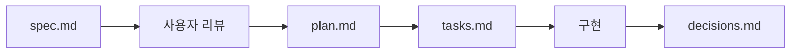

<h1 align="center">
  <strong>lee-spec-kit</strong>
</h1>

<div align="center">

</div>

<p align="center">
  <strong>AI 에이전트 기반 개발을 위한 프로젝트 문서 구조 생성 CLI</strong>
</p>

<p align="center">
  <a href="https://www.npmjs.com/package/lee-spec-kit"></a>
  
  <a href="https://opensource.org/licenses/MIT"></a>
</p>

<p align="center">
  <a href="#quick-start">Quick Start</a> •
  <a href="#주요-기능">주요 기능</a> •
  <a href="#사용법">사용법</a> •
  <a href="#생성되는-구조">생성되는 구조</a>
</p>

<p align="center">
  <a href="./README.en.md">
    
  </a>
  <a href="./README.md">
    
  </a>
</p>

---

## 목차

- [Quick Start](#quick-start)
- [주요 기능](#주요-기능)
- [사용법](#사용법)
- [설정 파일](#설정-파일)
- [오류 코드](#오류-코드)
- [생성되는 구조](#생성되는-구조)
- [Feature 워크플로우](#feature-워크플로우)
- [문제 해결](#문제-해결)
- [기여하기](#기여하기)
- [라이선스](#라이선스)

## Quick Start

```bash
# 1. 프로젝트 문서 구조 생성
npx lee-spec-kit init

# 2. 새 기능 생성
npx lee-spec-kit feature user-auth

# 3. 진행 상황 및 다음 단계 확인 (AI 에이전트용)
npx lee-spec-kit context

# 4. 전체 상태 확인
npx lee-spec-kit status

# 5. 문서/Feature 진단
npx lee-spec-kit doctor
```

## 주요 기능

### 📁 프로젝트 초기화

- 대화형 모드 또는 CLI 옵션으로 프로젝트 설정
- Single(단일 레포) / Fullstack(FE/BE 분리) 프로젝트 타입 지원
- 한국어/영어 템플릿 선택

### 🚀 Feature 생성

- spec.md, plan.md, tasks.md, decisions.md 자동 생성
- Fullstack 프로젝트의 경우 FE/BE 분리 지원
- GitHub Issue/PR 템플릿 연동

### 📊 상태 관리

- 전체 Feature 진행 상태 한눈에 확인
- 터미널 출력 또는 마크다운 파일로 저장

### 🩺 문서 진단 (Doctor)

- docs 구조/설정/Feature 메타데이터를 점검하여 잠재 문제를 빠르게 탐지
- `--json` 출력으로 에이전트 파이프라인에 쉽게 연동

### 🔄 자동 업데이트

- 최신 버전 체크 및 템플릿 업데이트 지원

## 사용법

### 프로젝트 초기화

```bash
# 대화형 모드
npx lee-spec-kit init

# 옵션 지정
npx lee-spec-kit init --name my-project --type fullstack
```

**옵션:**

| 옵션                | 설명                                                                 | 기본값                    |
| ------------------- | -------------------------------------------------------------------- | ------------------------- |
| `-n, --name <name>` | 프로젝트 이름                                                        | 현재 폴더명               |
| `-t, --type <type>` | `single` 또는 `fullstack`                                            | 대화형 선택 (`--yes`/`--non-interactive`면 `single`) |
| `-l, --lang <lang>` | `ko` (한국어) 또는 `en` (영어)                                       | `en`                      |
| `--workflow <mode>` | 워크플로우 모드: `github`(issue/PR/review 포함) 또는 `local`(로컬 중심) | `github`                  |
| `-d, --dir <dir>`   | 설치 디렉토리                                                        | `./docs`                  |
| `-y, --yes`         | 대화형 입력을 대부분 스킵 (단, 대상 디렉토리가 비어있지 않으면 덮어쓰기 확인은 표시) | -                         |
| `--non-interactive` | 사용자 입력이 필요하면 프롬프트 대신 즉시 실패                       | `false`                   |

> `init`은 docs 생성 후 Git 초기화/커밋(`git init`, `git add`, `git commit`)을 자동 시도합니다. 환경에 따라 자동 커밋이 생략될 수 있습니다.

### 새 기능 생성

```bash
# Single 프로젝트
npx lee-spec-kit feature user-auth

# Fullstack 프로젝트
npx lee-spec-kit feature --repo be user-auth
npx lee-spec-kit feature --repo fe user-profile

# Feature ID/설명 지정
npx lee-spec-kit feature payment --id F123 --desc "결제 플로우 개선"
```

**옵션:**

| 옵션                | 설명                                         | 기본값      |
| ------------------- | -------------------------------------------- | ----------- |
| `-r, --repo <repo>` | `fe` 또는 `be` (fullstack일 때만)            | 대화형 선택 |
| `--id <id>`         | Feature ID (`F001` 형식)                     | 자동 생성   |
| `-d, --desc <desc>` | `spec.md`의 목적(설명) 기본 문구             | 빈 문자열   |
| `--non-interactive` | 사용자 입력이 필요하면 프롬프트 대신 즉시 실패 | `false`     |

### Context 확인 (AI 에이전트 가이드)

현재 작업 중인 Feature의 상태와 다음 할 일을 확인합니다. 특히 AI 에이전트가 프로세스를 준수하는 데 유용합니다.
단일 Feature 상세에서는 다음 작업을 항상 `A/B/C` 옵션으로 표시합니다.

```bash
# 자동 감지 (Git 브랜치 기준)
npx lee-spec-kit context

# 특정 Feature 지정
npx lee-spec-kit context user-auth

# selector 지원: Feature ID / 폴더명
npx lee-spec-kit context F001
npx lee-spec-kit context F001-user-auth

# fullstack에서 레포 지정
npx lee-spec-kit context --repo fe

# 전체/완료 Feature 포함
npx lee-spec-kit context --all
npx lee-spec-kit context --done

# 에이전트용 JSON 출력
npx lee-spec-kit context --json

# 라벨 승인 선택 (검증만)
npx lee-spec-kit context F001 --approve A

# 라벨 승인 + 단일 명령 실행
npx lee-spec-kit context F001 --approve "A OK" --execute
```

**옵션:**

| 옵션            | 설명                                            |
| --------------- | ----------------------------------------------- |
| `--json`        | 에이전트용 JSON 출력                            |
| `--repo <repo>` | fullstack에서 대상 레포 지정 (`fe` 또는 `be`)   |
| `--all`         | 자동 감지 실패 시 완료된 Feature까지 포함해서 표시 |
| `--done`        | 완료(workflow-done) Feature만 표시              |
| `--approve <reply>` | 라벨 승인 응답 (`A` 또는 `A OK`)으로 단일 옵션 선택 |
| `--execute`     | `--approve`로 선택한 옵션이 command일 때 1개만 실행 |

`--json` 출력에는 다음 액션이 `actions` 배열로 포함됩니다.

- `reasonCode`: 상태 이유 코드 (`SINGLE_MATCHED`, `MULTIPLE_ACTIVE_FEATURES` 등)
- `type: "command"`: `scope`(project|docs), `cwd`, `cmd` 제공 (복사하여 붙여넣기 가능한 형태로 `cd ... && git ...` 형태로 출력)
- `type: "instruction"`: 사람이 수행해야 하는 안내 메시지
- `actionOptions`: `label`(`A`, `B`, `C`...)과 해당 `action` 매핑
- `category`: 액션 분류 (자동화/반자동용 `approval.mode: "category"`에서 사용)
- `requiresUserCheck`: 사용자 확인 필요 여부 (에이전트는 **사용자 응답을 `<라벨>` 또는 `<라벨> OK` 형식(예: `A`, `A OK`)으로 제한**하는 것을 권장 / 설정의 `approval`로 오버라이드 가능)
- `workflowPolicy`: 현재 완료 조건 정책 (`mode`, `requireIssue`, `requireBranch`, `requirePr`, `requireReview`)

또한 `checkPolicy`가 포함되어, 에이전트가 사용자 확인 정책을 적용할 때 참고할 수 있습니다. (`docPath`, `hint`, `token: "A"`, `acceptedTokens`, `tokenPattern`, `validLabels`, `contextVersion`, `config`)

오류 응답(`status: "error"`)에는 `reasonCode`와 `suggestions`(라벨형 다음 동작: `A/B/C`)가 포함됩니다. (예: `INVALID_APPROVAL`, `CONTEXT_STALE`, `EXECUTION_FAILED`)

### 상태 확인

```bash
# 터미널에 출력
npx lee-spec-kit status

# 파일로 저장
npx lee-spec-kit status --write

# 중복/누락 ID가 있으면 실패 코드로 종료
npx lee-spec-kit status --strict
```

**옵션:**

| 옵션           | 설명                                          |
| -------------- | --------------------------------------------- |
| `-w, --write`  | `features/status.md` 파일 생성                |
| `-s, --strict` | 중복/누락 Feature ID 발견 시 종료 코드 1 반환 |

### 문서 진단 (Doctor)

docs 구조 및 Feature 메타데이터(중복 ID, 누락된 파일/상태, 플레이스홀더 잔존 등)를 점검합니다.

```bash
# 진단 실행
npx lee-spec-kit doctor

# 문제 발견 시 종료 코드 1 (CI/에이전트 파이프라인용)
npx lee-spec-kit doctor --strict

# 에이전트용 JSON 출력
npx lee-spec-kit doctor --json
```

### 템플릿 업데이트

기본 동작은 `docs/` 작업트리에 변경사항이 없을 때만 업데이트를 진행하며, 이 경우 변경된 파일은 확인 없이 덮어씁니다.  
변경사항이 있는 상태에서 업데이트하려면 `--force`를 사용하세요.

```bash
# 전체 업데이트
npx lee-spec-kit update

# agents/ 폴더만 업데이트
npx lee-spec-kit update --agents

# agents/skills 폴더만 업데이트
npx lee-spec-kit update --skills

# feature-base/ 폴더만 업데이트
npx lee-spec-kit update --templates

# 변경사항이 있어도 강제 덮어쓰기
npx lee-spec-kit update --force
```

## 설정 파일

### `.lee-spec-kit.json`

`init`을 실행하면 문서 루트(기본: `docs/`)에 `.lee-spec-kit.json`이 생성됩니다.

```json
{
  "projectName": "my-project",
  "projectType": "single",
  "lang": "ko",
  "createdAt": "YYYY-MM-DD",
  "docsRepo": "embedded",
  "workflow": { "mode": "github" },
  "pr": { "screenshots": { "upload": false } },
  "approval": { "mode": "builtin" }
}
```

| 필드          | 설명                                    |
| ------------- | --------------------------------------- |
| `projectName` | 프로젝트 이름                           |
| `projectType` | `single` 또는 `fullstack`               |
| `lang`        | `ko` 또는 `en`                          |
| `createdAt`   | 생성 날짜                               |
| `docsRepo`    | `embedded` 또는 `standalone`            |
| `pushDocs`    | (standalone만) docs 레포를 별도 Git으로 관리/푸시할지 여부 |
| `docsRemote`  | (standalone+pushDocs) docs 레포 remote URL |
| `projectRoot` | (standalone만) 프로젝트 레포지토리 경로 (single: string, fullstack: {fe, be}) |
| `workflow`    | (선택) 워크플로우 요구사항 정책 (`github`/`local`) |
| `pr`          | (선택) PR 결과물 정책 (예: 스크린샷 업로드 여부) |
| `approval`    | (선택) `context` 출력의 `[확인 필요]`/`requiresUserCheck` 정책 오버라이드 (자동화/반자동용) |

> `docsRepo: "standalone"`을 선택하면 `pushDocs`, `docsRemote`, `projectRoot`가 추가됩니다.

> 어디서 실행하든 설정을 찾을 수 있도록, CLI는 현재 디렉토리에서 상위로 올라가며 `.lee-spec-kit.json` 또는 `docs/.lee-spec-kit.json`을 탐색합니다.
> standalone 환경에서 docs 레포 바깥(예: 프로젝트 레포)에서 실행해야 한다면 `LEE_SPEC_KIT_DOCS_DIR`에 docs 레포 경로를 지정할 수 있습니다.

### approval (사용자 확인 정책)

`approval`은 `context`가 출력하는 다음 값에만 영향을 줍니다:

- 텍스트 출력의 `[확인 필요]` 표시
- `context --json`의 `actions[].requiresUserCheck`
- `checkPolicy.token` (`context --json`): 승인 토큰 형식 예시 (`A`)
- `checkPolicy.acceptedTokens`: 허용되는 승인 응답 예시 (예: `["A", "A OK"]`)
- `checkPolicy.tokenPattern`: 승인 응답 검증용 정규식
- `checkPolicy.validLabels`: 현재 선택 가능한 라벨 목록 (`A`, `B`, `C`...)
- `checkPolicy.contextVersion`: stale context 검증용 스냅샷 해시

> 실제 명령 실행을 강제/차단하는 기능은 아닙니다. (에이전트가 참고하도록 신호를 제공)
> 기존 설정에 `approval`이 없으면 `builtin`으로 동작합니다. (마이그레이션 불필요)
> `requiresUserCheck: true`인 액션은 에이전트가 사용자로부터 **정확히 `<라벨>` 또는 `<라벨> OK` 응답(예: `A`, `A OK`)**을 받은 뒤 진행하는 것을 권장합니다.

### workflow (완료 조건 정책)

- `workflow.mode: "github"` (기본): Issue/브랜치/PR/리뷰 단계를 포함한 전체 워크플로우를 완료 조건으로 사용
- `workflow.mode: "local"`: 로컬 중심 워크플로우로 동작하며 Issue/브랜치/PR/리뷰 단계를 필수로 요구하지 않음

예시:

```json
{
  "workflow": { "mode": "local" }
}
```

#### 모드

- `builtin` (기본): 코드에 내장된 `requiresUserCheck`를 그대로 사용
- `category` (권장): `actions[].category` 기준으로 확인 정책을 제어
- `steps`: step 번호 기준(변경에 취약하므로 권장하지 않음)

#### 설정 필드

- `default` (`category`만): `keep` | `require` | `skip` (기본: `keep`)
- `requireCheckCategories` (`category`만): 확인을 **항상** 요구할 category 목록 (예: `["pr_create"]`, `["*"]`)
- `skipCheckCategories` (`category`만): 확인을 **절대** 요구하지 않을 category 목록 (예: `["docs_commit"]`, `["*"]`)
- `requireCheckSteps` (`steps`만): 확인이 필요한 step 번호 목록 (예: `[3, 5, 12]`)

#### category 예시

```json
{
  "approval": { "mode": "category", "default": "skip" }
}
```

```json
{
  "approval": {
    "mode": "category",
    "default": "keep",
    "skipCheckCategories": ["docs_commit"]
  }
}
```

> 사용 가능한 `category` 값은 `context --json`의 `actions[].category`로 확인하는 것을 권장합니다.

### pr (PR 결과물 정책)

- `pr.screenshots.upload` (기본: `false`): `true`면 스크린샷을 업로드(예: GitHub Release assets)하고 PR 본문에 URL을 포함할 수 있습니다. `false`면 업로드/URL 포함을 하지 않으며 PR 본문에서도 스크린샷 섹션을 만들지 않는 것을 권장합니다.

### Standalone 프로젝트 설정 예시

**Single 프로젝트:**

```json
{
  "projectName": "my-project",
  "projectType": "single",
  "lang": "ko",
  "createdAt": "YYYY-MM-DD",
  "docsRepo": "standalone",
  "pushDocs": false,
  "projectRoot": "/path/to/my-project"
}
```

**Fullstack 프로젝트:**

```json
{
  "projectName": "my-project",
  "projectType": "fullstack",
  "lang": "ko",
  "createdAt": "YYYY-MM-DD",
  "docsRepo": "standalone",
  "pushDocs": false,
  "projectRoot": {
    "fe": "/path/to/frontend",
    "be": "/path/to/backend"
  }
}
```

### 설정 확인 및 수정

```bash
# 현재 설정 확인
npx lee-spec-kit config

# projectRoot 수정 (Single)
npx lee-spec-kit config --project-root /new/path

# projectRoot 수정 (Fullstack)
npx lee-spec-kit config --project-root /new/fe/path --repo fe
npx lee-spec-kit config --project-root /new/be/path --repo be

# 비대화형 모드 (필수 옵션 누락 시 즉시 실패)
npx lee-spec-kit config --project-root /new/fe/path --repo fe --non-interactive
```

**옵션:**

| 옵션                 | 설명 |
| -------------------- | ---- |
| `--project-root <path>` | projectRoot 경로 설정 |
| `--repo <repo>` | fullstack 대상 레포 (`fe` 또는 `be`) |
| `--non-interactive` | 사용자 입력이 필요하면 프롬프트 대신 즉시 실패 |

> `--non-interactive`는 `init`, `feature`, `config`에서 지원됩니다.
> 오류 시 출력되는 `[REASON_CODE]` 형식(`PROMPT_BLOCKED`, `CONFIG_NOT_FOUND` 등)은 자동화 분기용으로 사용할 수 있습니다.
> 또한 텍스트 모드 오류에는 `👉 Next Options (Error)`로 `A/B/C` 제안이 함께 출력됩니다.

## 오류 코드

- 이 CLI는 자동화 분기를 위해 에러에 `reasonCode`(JSON) 또는 `[REASON_CODE]`(텍스트)를 제공합니다.
- 오류 시 다음 동작 제안이 `A/B/C` 라벨로 함께 제공됩니다. (JSON: `suggestions`, 텍스트: `👉 Next Options (Error)`)
- 대표 코드:
  - `PROMPT_BLOCKED`: 비대화형 모드에서 사용자 입력이 필요함
  - `CONFIG_NOT_FOUND`: `.lee-spec-kit.json`을 찾지 못함
  - `DOCS_NOT_FOUND`: docs 구조를 찾지 못함
  - `LOCK_WAIT_TIMEOUT` / `LOCK_ACQUIRE_TIMEOUT`: 락 대기/획득 타임아웃
  - `INVALID_APPROVAL`, `CONTEXT_STALE`, `EXECUTION_FAILED`: `context --approve/--execute` 흐름 오류

상세 코드 목록과 의미는 `errors.md`(한국어), `errors.en.md`(English)를 참고하세요.

## 생성되는 구조

### Fullstack (FE/BE 분리)

```
docs/
├── README.md
├── agents/
│   ├── agents.md           # 에이전트 운영 규칙
│   ├── constitution.md     # 프로젝트 원칙
│   ├── custom.md           # 프로젝트별 추가 규칙
│   ├── git-workflow.md     # Git 자동화 규칙
│   ├── issue-template.md
│   ├── pr-template.md
│   └── skills/             # 에이전트 실행 가이드
├── designs/                # 디자인 참고 자료
├── ideas/                  # 아이디어/To-do (Feature 승격 전)
├── prd/
│   └── README.md
├── scripts/
│   └── README.md
└── features/
    ├── README.md
    ├── feature-base/       # 공용 템플릿
    ├── be/                 # Backend Features
    └── fe/                 # Frontend Features
```

### Single (단일 레포)

```
docs/
├── README.md
├── agents/
│   ├── custom.md
│   └── skills/
├── designs/
├── ideas/
├── prd/
├── scripts/
└── features/
    ├── feature-base/
    └── F001-feature/       # 개별 기능
```

## Feature 워크플로우



1. **spec.md 작성** - 무엇을, 왜 만드는지 정의
2. **사용자 리뷰 요청** - 스펙 검토 및 승인
3. **plan.md 작성** - 어떻게 만드는지 (기술 스택, 설계)
4. **tasks.md 작성** - 태스크 분해 및 체크리스트
5. **decisions.md** - 기술 결정 기록 (ADR)

| 프로젝트 타입 | 설명                                         |
| ------------- | -------------------------------------------- |
| `single`      | 단일 레포 프로젝트 (모노레포 또는 단일 스택) |
| `fullstack`   | FE/BE 분리 프로젝트                          |

## 문제 해결

<details>
<summary><strong>init 명령어가 실패합니다</strong></summary>

- Node.js 18 이상이 설치되어 있는지 확인하세요
- `npx` 캐시 문제일 수 있습니다: `npx clear-npx-cache` 후 재시도

</details>

<details>
<summary><strong>feature 명령어가 설정 파일을 찾지 못합니다</strong></summary>

- `docs/` 폴더에 `.lee-spec-kit.json` 파일이 있는지 확인하세요
- `init` 명령어를 먼저 실행했는지 확인하세요
- embedded 모드라면 프로젝트 루트/하위 어디서 실행해도 상위 디렉토리 탐색으로 설정을 찾습니다.
- standalone 모드에서 docs 레포 밖에서 실행 중이면, docs 레포로 이동하거나 `LEE_SPEC_KIT_DOCS_DIR=/path/to/docs`를 설정하세요.

</details>

<details>
<summary><strong>Fullstack 프로젝트에서 --repo 옵션이 동작하지 않습니다</strong></summary>

- `.lee-spec-kit.json`의 `projectType`이 `fullstack`인지 확인하세요
- `--repo` 값은 `fe` 또는 `be`만 가능합니다

</details>

## 기여하기

1. Fork → 브랜치 생성 → 개발 → Pull Request

이슈나 PR은 언제든 환영합니다!

## 라이선스

[MIT License](./LICENSE)

---

<p align="center">
  Made with ❤️ by <a href="https://github.com/leey00nsu">leey00nsu</a>
</p>
