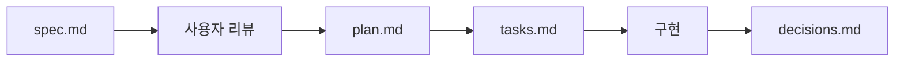

<h1 align="center">
  <strong>lee-spec-kit</strong>
</h1>

<p align="center">
  <strong>AI 에이전트 기반 개발을 위한 프로젝트 문서 구조 생성 CLI</strong>
</p>

<p align="center">
  <a href="https://www.npmjs.com/package/lee-spec-kit"></a>
  
  <a href="https://opensource.org/licenses/MIT"></a>
</p>

<p align="center">
  <a href="#quick-start">Quick Start</a> •
  <a href="#주요-기능">주요 기능</a> •
  <a href="#사용법">사용법</a> •
  <a href="#생성되는-구조">생성되는 구조</a>
</p>

<p align="center">
  <a href="./README.en.md">
    
  </a>
  <a href="./README.md">
    
  </a>
</p>

---

## 목차

- [Quick Start](#quick-start)
- [주요 기능](#주요-기능)
- [사용법](#사용법)
- [설정 파일](#설정-파일)
- [생성되는 구조](#생성되는-구조)
- [Feature 워크플로우](#feature-워크플로우)
- [문제 해결](#문제-해결)
- [기여하기](#기여하기)
- [라이선스](#라이선스)

## Quick Start

```bash
# 1. 프로젝트 문서 구조 생성
npx lee-spec-kit init

# 2. 새 기능 생성
npx lee-spec-kit feature user-auth

# 3. 상태 확인
npx lee-spec-kit status
```

## 주요 기능

### 📁 프로젝트 초기화

- 대화형 모드 또는 CLI 옵션으로 프로젝트 설정
- Single(단일 레포) / Fullstack(FE/BE 분리) 프로젝트 타입 지원
- 한국어/영어 템플릿 선택

### 🚀 Feature 생성

- spec.md, plan.md, tasks.md, decisions.md 자동 생성
- Fullstack 프로젝트의 경우 FE/BE 분리 지원
- GitHub Issue/PR 템플릿 연동

### 📊 상태 관리

- 전체 Feature 진행 상태 한눈에 확인
- 터미널 출력 또는 마크다운 파일로 저장

### 🔄 자동 업데이트

- 최신 버전 체크 및 템플릿 업데이트 지원

## 사용법

### 프로젝트 초기화

```bash
# 대화형 모드
npx lee-spec-kit init

# 옵션 지정
npx lee-spec-kit init --name my-project --type fullstack --lang ko
```

**옵션:**

| 옵션                | 설명                           | 기본값      |
| ------------------- | ------------------------------ | ----------- |
| `-n, --name <name>` | 프로젝트 이름                  | 현재 폴더명 |
| `-t, --type <type>` | `single` 또는 `fullstack`      | 대화형 선택 |
| `-l, --lang <lang>` | `ko` (한국어) 또는 `en` (영어) | `ko`        |
| `-d, --dir <dir>`   | 설치 디렉토리                  | `./docs`    |
| `-y, --yes`         | 대화형 프롬프트 스킵           | -           |

### 새 기능 생성

```bash
# Single 프로젝트
npx lee-spec-kit feature user-auth

# Fullstack 프로젝트
npx lee-spec-kit feature --repo be user-auth
npx lee-spec-kit feature --repo fe user-profile
```

### 상태 확인

```bash
# 터미널에 출력
npx lee-spec-kit status

# 파일로 저장
npx lee-spec-kit status --write
```

### 템플릿 업데이트

```bash
# 전체 업데이트
npx lee-spec-kit update

# agents/ 폴더만 업데이트
npx lee-spec-kit update --agents

# feature-base/ 폴더만 업데이트
npx lee-spec-kit update --templates

# 확인 없이 강제 덮어쓰기
npx lee-spec-kit update --force
```

## 설정 파일

### `.lee-spec-kit.json`

`init`을 실행하면 문서 루트(기본: `docs/`)에 `.lee-spec-kit.json`이 생성됩니다.

```json
{
  "projectName": "my-project",
  "projectType": "single",
  "lang": "ko",
  "createdAt": "YYYY-MM-DD",
  "docsRepo": "embedded"
}
```

| 필드          | 설명                                    |
| ------------- | --------------------------------------- |
| `projectName` | 프로젝트 이름                           |
| `projectType` | `single` 또는 `fullstack`               |
| `lang`        | `ko` 또는 `en`                          |
| `createdAt`   | 생성 날짜                               |
| `docsRepo`    | `embedded` 또는 `standalone`            |
| `projectRoot` | (standalone만) 프로젝트 레포지토리 경로 |

> `docsRepo: "standalone"`을 선택하면 `pushDocs`, `docsRemote`, `projectRoot`가 추가됩니다.

### Standalone 프로젝트 설정 예시

**Single 프로젝트:**

```json
{
  "projectName": "my-project",
  "projectType": "single",
  "docsRepo": "standalone",
  "projectRoot": "/path/to/my-project"
}
```

**Fullstack 프로젝트:**

```json
{
  "projectName": "my-project",
  "projectType": "fullstack",
  "docsRepo": "standalone",
  "projectRoot": {
    "fe": "/path/to/frontend",
    "be": "/path/to/backend"
  }
}
```

### 설정 확인 및 수정

```bash
# 현재 설정 확인
npx lee-spec-kit config

# projectRoot 수정 (Single)
npx lee-spec-kit config --project-root /new/path

# projectRoot 수정 (Fullstack)
npx lee-spec-kit config --project-root /new/fe/path --repo fe
npx lee-spec-kit config --project-root /new/be/path --repo be
```

## 생성되는 구조

### Fullstack (FE/BE 분리)

```
docs/
├── README.md
├── agents/
│   ├── agents.md           # 에이전트 운영 규칙
│   ├── constitution.md     # 프로젝트 원칙
│   ├── git-workflow.md     # Git 자동화 규칙
│   ├── issue-template.md
│   └── pr-template.md
├── designs/                # 디자인 참고 자료
├── ideas/                  # 아이디어/To-do (Feature 승격 전)
├── prd/
│   └── README.md
└── features/
    ├── README.md
    ├── feature-base/       # 공용 템플릿
    ├── be/                 # Backend Features
    └── fe/                 # Frontend Features
```

### Single (단일 레포)

```
docs/
├── README.md
├── agents/
├── designs/
├── ideas/
├── prd/
└── features/
    ├── feature-base/
    └── F001-feature/       # 개별 기능
```

## Feature 워크플로우



1. **spec.md 작성** - 무엇을, 왜 만드는지 정의
2. **사용자 리뷰 요청** - 스펙 검토 및 승인
3. **plan.md 작성** - 어떻게 만드는지 (기술 스택, 설계)
4. **tasks.md 작성** - 태스크 분해 및 체크리스트
5. **decisions.md** - 기술 결정 기록 (ADR)

| 프로젝트 타입 | 설명                                         |
| ------------- | -------------------------------------------- |
| `single`      | 단일 레포 프로젝트 (모노레포 또는 단일 스택) |
| `fullstack`   | FE/BE 분리 프로젝트                          |

## 문제 해결

<details>
<summary><strong>init 명령어가 실패합니다</strong></summary>

- Node.js 18 이상이 설치되어 있는지 확인하세요
- `npx` 캐시 문제일 수 있습니다: `npx clear-npx-cache` 후 재시도

</details>

<details>
<summary><strong>feature 명령어가 설정 파일을 찾지 못합니다</strong></summary>

- `docs/` 폴더에 `.lee-spec-kit.json` 파일이 있는지 확인하세요
- `init` 명령어를 먼저 실행했는지 확인하세요

</details>

<details>
<summary><strong>Fullstack 프로젝트에서 --repo 옵션이 동작하지 않습니다</strong></summary>

- `.lee-spec-kit.json`의 `projectType`이 `fullstack`인지 확인하세요
- `--repo` 값은 `fe` 또는 `be`만 가능합니다

</details>

## 기여하기

1. Fork → 브랜치 생성 → 개발 → Pull Request

이슈나 PR은 언제든 환영합니다!

## 라이선스

[MIT License](./LICENSE)

---

<p align="center">
  Made with ❤️ by <a href="https://github.com/leey00nsu">leey00nsu</a>
</p>
