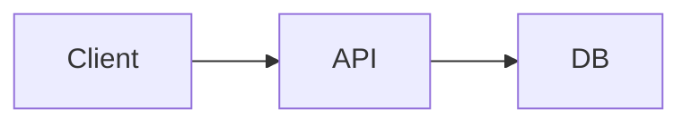

# GitHub PR Template Guide

A template for AI agents to create Pull Requests.

---

## PR Creation Rules

### Title Format

```text
feat(#{issue-number}): {feature-name} ({short description})
```

Example: `feat(#1): user-auth (User authentication feature)`

### Link Format (Important!)

For file links within the repo in PR body, **always use current branch name**:

```markdown
[filename](https://github.com/{owner}/{repo}/blob/{branch-name}/docs/path/to/file.md)
```

> ⚠️ `main` branch links will return 404 until merged!
> Always use the **current feature branch name** (e.g., `feat/5-feature-name`).

---

## PR Body Template

```markdown
## Overview

{Brief description of changes}

## Changes

- {Change 1}
- {Change 2}
- {Change 3}

## Tests

> ⚠️ **Check only after running tests. Do NOT check items that were not executed.**

- [ ] Unit tests passed
- [ ] Integration tests completed

### Execution Results

- Command: `{test command executed}`
- Result: `{PASS/FAIL summary}`

## Screenshots (Frontend / UI changes)

> If you follow the Release assets upload flow in `skills/create-pr.md`, you can include images in the PR body without committing files to your branch.

{Screenshot markdown (e.g. )}

## Architecture Diagram (Backend / core structure changes)



## Related Documents

- **Spec**: `{{featurePath}}/F{number}-{feature-name}/spec.md`
- **Tasks**: `{{featurePath}}/F{number}-{feature-name}/tasks.md`

Closes #{issue-number}
```

---

## PR Creation Command

```bash
# Check current branch name
BRANCH=$(git branch --show-current)

gh pr create \
  --title "feat(#{issue}): {feature-name} ({short description})" \
  --body-file /tmp/pr-body.md \
  --base main
```

---

## Merge Rules

| Situation      | Merge Method     |
| -------------- | ---------------- |
| Normal Feature | Squash and Merge |
| Urgent Hotfix  | Squash and Merge |
| Docs update    | Squash and Merge |

### Merge Execution

After all reviews are resolved:

```bash
# Update main before merge
git checkout main
git pull

# Squash and Merge
gh pr merge --squash --delete-branch

# Update main after merge
git pull
```

---

## Label Rules

- Specify appropriate labels when creating PR (`--label`)
- If a label does not exist, create it first:
  ```bash
  gh label create "label-name" --description "description" --color "color-code"
  ```

---

## Assignee Rules

- Default: Self-assign (`--assignee @me`)
- Use `--reviewer` option to specify reviewers
- Examples:
  ```bash
  gh pr create --assignee @me --reviewer reviewer-username ...
  ```

---

## Body Input Rules (Shell Execution Prevention)

- PR body should use **`--body-file` by default**.
- If the body contains backticks (`) or `$()`and is placed directly in`"..."`, it may be **interpreted by the shell**.
- For multi-line bodies, use **single-quoted heredoc** like `cat <<'EOF'`,
  and handle variables via **placeholder → sed substitution**.
