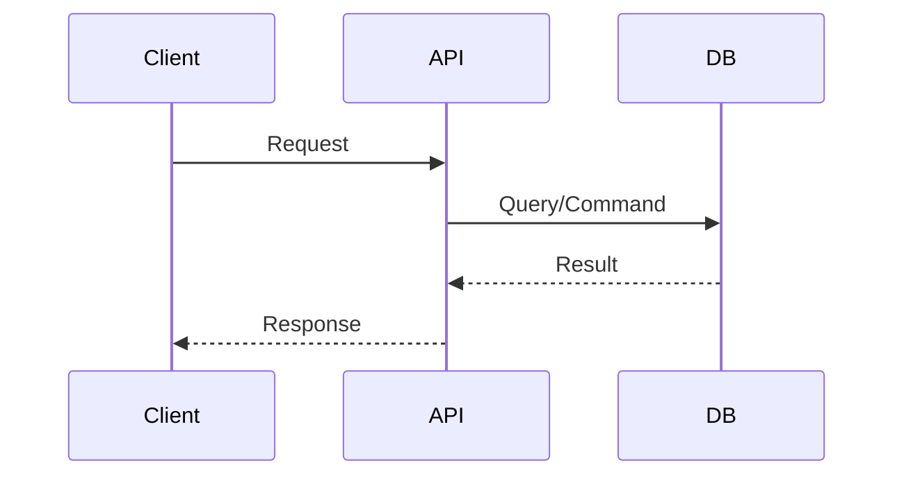

# GitHub PR 템플릿 가이드

에이전트가 Pull Request를 생성할 때 참조하는 템플릿입니다.

---

## PR 생성 규칙

### 제목 형식

```text
feat(#{이슈번호}): {기능명} ({짧은 설명})
```

예: `feat(#1): user-auth (사용자 인증 기능)`

### 링크 형식 (중요!)

PR 본문에서 레포 내 파일 링크는 **반드시 현재 브랜치명을 사용**:

```markdown
[파일명](https://github.com/{owner}/{repo}/blob/{브랜치명}/docs/path/to/file.md)
```

> ⚠️ `main` 브랜치 링크는 머지 전까지 404가 발생합니다!
> 반드시 **현재 피처 브랜치명** (예: `feat/5-feature-name`)을 사용하세요.

### 라벨 (필수)

- PR에는 **최소 1개 라벨이 반드시 필요**합니다. (비워둘 수 없음)
- 어떤 라벨을 써야 할지 확신이 없으면 PR 생성 전에 사용자에게 확인하세요.

## PR 본문 템플릿

```markdown
## 개요

{변경 사항에 대한 간략한 설명}

## 변경 사항

- {변경 1}
- {변경 2}
- {변경 3}

## 테스트

> ⚠️ **실제로 실행한 테스트만** 아래에 항목을 추가하고, **모두 체크([x])** 하세요.  
> 미실행 테스트는 항목을 만들지 않습니다.

### 실행한 테스트

- [x] `{테스트 명령어 1}` — PASS
- [x] `{테스트 명령어 2}` — PASS

### 로그/비고 (선택)

- {추가 설명 또는 로그 링크}

> - UI 변경에 해당된다면 **스크린샷을** 포함하세요.
> - 로직/구조 변경에 해당된다면 **다이어그램을** 포함하세요.

## 스크린샷 (프론트엔드 / UI 변경 시)

<!-- UI 변경이 아니거나, 스크린샷을 업로드하지 않았다면(예: `.lee-spec-kit.json`의 `pr.screenshots.upload: false`) 이 섹션은 제거하세요. -->
> `skills/create-pr.md`의 Release assets 업로드 절차를 사용하면 브랜치에 파일을 커밋하지 않고도 이미지를 본문에 포함할 수 있습니다.

{스크린샷 마크다운 (예: )}

## 아키텍처 다이어그램 (백엔드 / 핵심 구조 변경 시)



## 관련 문서

- **Spec**: `{{featurePath}}/F{번호}-{기능명}/spec.md`
- **Tasks**: `{{featurePath}}/F{번호}-{기능명}/tasks.md`

Closes #{이슈번호}
```

---

## PR 생성 명령어

```bash
# 현재 브랜치명 확인
BRANCH=$(git branch --show-current)

gh pr create \
  --title "feat(#{issue}): {기능명} ({짧은 설명})" \
  --body-file /tmp/pr-body.md \
  --base main
```

---

## 머지 규칙

| 상황         | 머지 방식        |
| ------------ | ---------------- |
| 일반 Feature | Squash and Merge |
| 긴급 Hotfix  | Squash and Merge |
| 문서 수정    | Squash and Merge |

### 머지 실행

모든 리뷰 해결 시:

> ⚠️ 머지(`git merge`/`gh pr merge`) 및 머지 커밋 생성은 **Git 원격 작업**에 해당합니다.
> 실행 전 변경 사항을 사용자에게 공유하고, 사용자가 **정확히 `OK`**라고 답한 뒤에만 진행하세요.

```bash
# 머지 전 main 최신화
git checkout main
git pull

# Squash and Merge
gh pr merge --squash --delete-branch

# 머지 후 main 최신화
git pull
```

---

## 라벨 규칙

- PR 생성 시 적절한 라벨 지정 (`--label`)
- 라벨이 존재하지 않으면 먼저 생성:
  ```bash
  gh label create "라벨명" --description "설명" --color "색상코드"
  ```

---

## Assignee 규칙

- 기본값: 본인 할당 (`--assignee @me`)
- 리뷰어 지정 시 `--reviewer` 옵션 사용
- 예시:
  ```bash
  gh pr create --assignee @me --reviewer reviewer-username ...
  ```

---

## 본문 입력 규칙 (셸 실행 방지)

- PR 본문은 **`--body-file` 사용을 기본**으로 한다.
- 백틱(`)이나 `$()`가 포함된 본문을 `"..."`에 직접 넣으면 **셸에서 명령치환**될 수 있다.
- 여러 줄 본문은 `cat <<'EOF'` 형식의 **싱글 쿼트 heredoc**을 사용하고,
  필요한 변수는 **플레이스홀더 → sed 치환**으로 처리한다.
